# Cheats

 My cheatsheets for [navi](https://github.com/denisidoro/navi).

In order to add this repository as a featured cheatsheet repo, [edit this file](https://github.com/denisidoro/cheats/edit/master/featured_repos.txt). This list will be displayed when `navi repo browse` is run and my cheats will be one of the alternatives.
